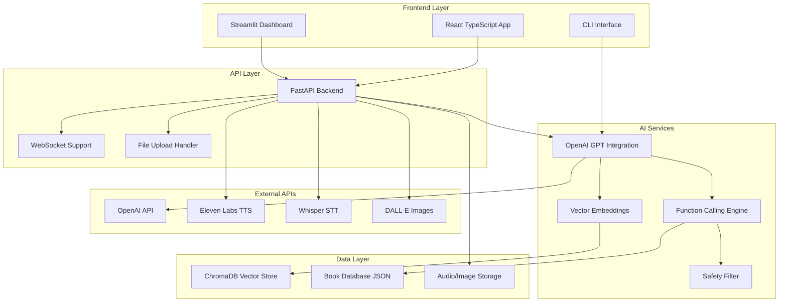
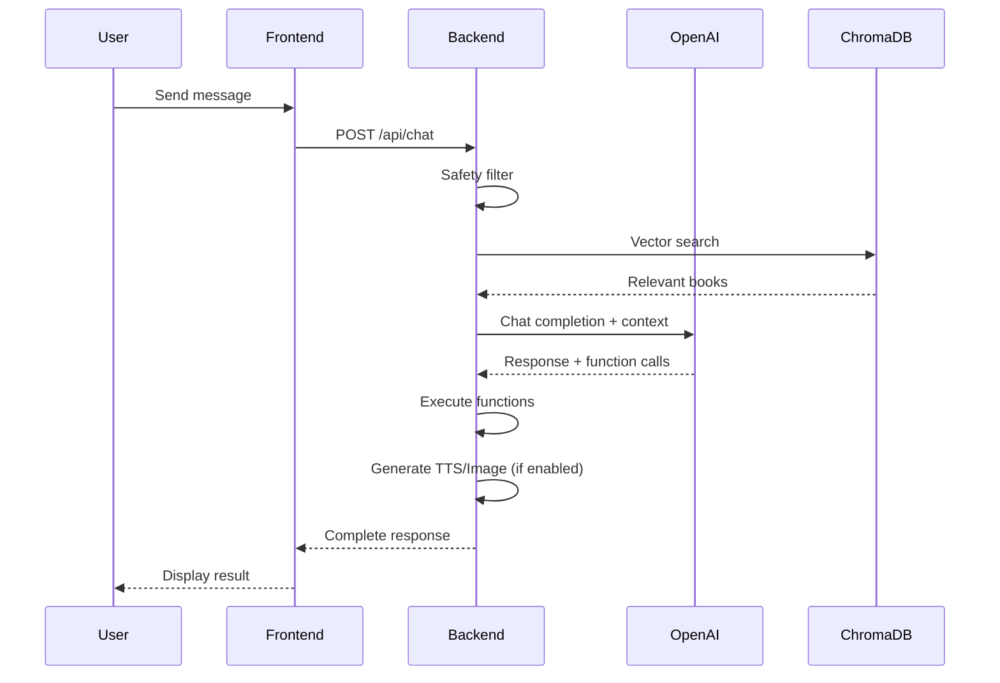

# 📚 Smart Librarian AI

**Professional AI-powered book recommendation system with modern React frontend and intelligent backend services.**

A comprehensive book discovery platform that combines **OpenAI GPT** for intelligent conversations, **ChromaDB** for semantic search, and **React TypeScript** for a modern user experience. Features include voice interaction, image generation, and real-time AI recommendations with both web and CLI interfaces.

## 🌟 Key Features
## 💻 CLI Commands Reference

### 📋 Command Overview

| Command | Description | Key Options |
|---------|-------------|--------------|
| `chat` | Interactive AI conversation | `--tts`, `--voice`, `--image`, `--history` |
| `ingest` | Initialize/rebuild vector database | `--force` |
| `status` | System health and component status | None |
| `test` | Run comprehensive diagnostics | `--verbose` |
| `search` | Direct book search (bypass chat) | `--query`, `--limit` |

### 💬 Chat Commands

```bash
# Basic conversation
python -m src.interfaces.chatbot_cli chat

# Full multimedia experience
python -m src.interfaces.chatbot_cli chat --tts --voice --image

# Voice-only interaction
python -m src.interfaces.chatbot_cli chat --voice

# Show conversation history
python -m src.interfaces.chatbot_cli chat --history

# Quiet mode (no animations)
python -m src.interfaces.chatbot_cli chat --quiet
```

### 🗄️ Database Commands

```bash
# Initialize vector database (first time)
python -m src.interfaces.chatbot_cli ingest

# Force complete rebuild
python -m src.interfaces.chatbot_cli ingest --force

# Backup current database
python -m src.interfaces.chatbot_cli backup

# Restore from backup
python -m src.interfaces.chatbot_cli restore --file backup.db
```

### 🔍 Search Commands

```bash
# Direct book search
python -m src.interfaces.chatbot_cli search --query "fantasy adventure"

# Limit results
python -m src.interfaces.chatbot_cli search --query "war stories" --limit 5

# Export search results
python -m src.interfaces.chatbot_cli search --query "dystopian" --output results.json
```

### 📊 System Commands

```bash
# Complete system status
python -m src.interfaces.chatbot_cli status

# Detailed component testing
python -m src.interfaces.chatbot_cli test --verbose

# Performance benchmark
python -m src.interfaces.chatbot_cli benchmark

# Configuration validation
python -m src.interfaces.chatbot_cli validate-config
```

### �️ Chat Session Options

#### Multimedia Flags
- `--tts` - Enable text-to-speech responses
- `--voice` - Enable voice input recording
- `--image` - Generate book cover images
- `--all-media` - Enable all multimedia features

#### Display Options
- `--history` - Show previous conversation
- `--quiet` - Minimal output, no animations
- `--rich` - Enhanced terminal formatting
- `--json` - Output responses in JSON format

#### Advanced Options
- `--model MODEL` - Override default AI model
- `--temperature FLOAT` - Adjust response creativity (0.0-2.0)
- `--max-tokens INT` - Limit response length
- `--top-k INT` - Number of search results to consider

### 📝 Usage Examples

```bash
# Perfect for first-time users
python -m src.interfaces.chatbot_cli chat --rich

# Content creators (generate covers)
python -m src.interfaces.chatbot_cli chat --image --tts

# Accessibility-focused
python -m src.interfaces.chatbot_cli chat --voice --tts --quiet

# Developer testing
python -m src.interfaces.chatbot_cli chat --json --temperature 0.1

# Performance testing
python -m src.interfaces.chatbot_cli benchmark --iterations 100
```apabilities
- **🤖 Intelligent AI Chat** - Natural conversations for personalized book recommendations
- **🔍 Semantic Search** - Advanced vector-based book discovery using ChromaDB
- **📚 Function Calling** - Automatic detailed book summaries and information retrieval
- **🛡️ Content Safety** - Built-in safety filters for appropriate interactions
- **📊 Real-time Metrics** - Live system monitoring and performance tracking

### 🎨 Modern Interfaces
- **🌐 React Web App** - Modern TypeScript frontend with responsive design
- **💻 CLI Interface** - Rich command-line experience with Typer
- **📱 Mobile Optimized** - Touch-friendly interface for all devices
- **🎪 Streamlit Dashboard** - Alternative web interface for data exploration

### 🎵 Multimedia Features
- **🎤 Voice Input** - Speech-to-text using OpenAI Whisper and SpeechRecognition
- **🔊 Audio Output** - Text-to-speech with gTTS and pyttsx3
- **🎨 Image Generation** - AI-powered book cover creation with DALL-E
- **📂 File Upload** - Audio file transcription support

### 🏗️ Technical Excellence
- **⚡ FastAPI Backend** - High-performance REST API with async support
- **🗄️ Vector Database** - Local ChromaDB for fast, persistent search
- **📝 TypeScript Frontend** - Type-safe React application with modern tooling
- **🔄 State Management** - Zustand for efficient client-side state
- **📊 API Documentation** - Auto-generated Swagger/OpenAPI docs

## 📖 Curated Book Collection

Smart Librarian features a carefully curated dataset of **12 classic literature masterpieces** with comprehensive summaries and thematic analysis:

| Title | Author | Themes |
|-------|---------|---------|
| 1984 | George Orwell | Freedom, social control, surveillance |
| The Hobbit | J.R.R. Tolkien | Adventure, friendship, courage |
| Dune | Frank Herbert | Power, politics, ecology |
| To Kill a Mockingbird | Harper Lee | Justice, prejudice, moral courage |
| The Catcher in the Rye | J.D. Salinger | Adolescence, alienation, identity |
| The Lord of the Rings | J.R.R. Tolkien | Good vs evil, friendship, sacrifice |
| Pride and Prejudice | Jane Austen | Love, prejudice, society |
| The Name of the Wind | Patrick Rothfuss | Magic, knowledge, revenge |
| The Book Thief | Markus Zusak | War, hope, power of words |
| The Kite Runner | Khaled Hosseini | Friendship, guilt, redemption |
| Brave New World | Aldous Huxley | Social control, technology, freedom |
| Fahrenheit 451 | Ray Bradbury | Censorship, knowledge, rebellion |

## 🏗️ System Architecture



### 🧩 Core Components

#### Frontend Applications
- **React Web App** (`frontend/`) - Modern TypeScript SPA with Tailwind CSS
- **CLI Interface** (`src/interfaces/chatbot_cli.py`) - Rich terminal experience
- **Streamlit Dashboard** (`src/chatbot_streamlit.py`) - Data exploration interface

#### Backend Services
- **FastAPI Server** (`backend/main.py`) - RESTful API with async support
- **AI Engine** (`src/ai/llm.py`) - OpenAI GPT integration with function calling
- **Vector Search** (`src/core/retriever.py`) - Semantic book discovery
- **Safety Module** (`src/safety.py`) - Content moderation and filtering

#### Data & Storage
- **ChromaDB** (`src/vector/vector_store.py`) - Vector database for embeddings
- **Book Data** (`data/`) - Curated collection with detailed summaries
- **Media Storage** (`output/`) - Generated audio files and images

#### Integration Services
- **Text-to-Speech** (`src/tts.py`) - Multi-provider audio generation
- **Speech-to-Text** (`src/stt.py`) - Voice input processing
- **Image Generation** (`src/image_gen.py`) - AI-powered book covers

## 🚀 Installation & Setup

### Prerequisites

- **Python 3.8+** - Backend services and AI integration
- **Node.js 18+** - Frontend development and build tools
- **OpenAI API Key** - Required for AI chat and embeddings
- **Git** - Version control

### 🔧 Quick Start (Recommended)

```bash
# Clone the repository
git clone <repository-url>
cd smart-librarian

# Backend setup
python -m venv venv
# Windows
venv\Scripts\activate
# Linux/Mac
source venv/bin/activate

pip install -r requirements.txt

# Frontend setup
cd frontend
npm install
cd ..

# Configure environment
echo "OPENAI_API_KEY=sk-your-key-here" > .env
echo "VITE_API_BASE_URL=http://localhost:8000" > frontend/.env.local

# Initialize data
python -m src.interfaces.chatbot_cli ingest

# Start services
# Terminal 1 - Backend
python backend/main.py

# Terminal 2 - Frontend
cd frontend && npm run dev
```

### 📦 Detailed Installation

#### 1. Repository Setup
```bash
git clone <repository-url>
cd smart-librarian
```

#### 2. Backend Environment
```bash
# Create and activate virtual environment
python -m venv venv

# Windows
venv\Scripts\activate

# Linux/Mac
source venv/bin/activate

# Install Python dependencies
pip install -r requirements.txt

# Install backend-specific dependencies
cd backend
pip install -r requirements.txt
cd ..
```

#### 3. Frontend Environment
```bash
# Navigate to frontend directory
cd frontend

# Install Node.js dependencies
npm install

# Build for development
npm run dev

# Return to root
cd ..
```

#### 4. Environment Configuration

**Main `.env` file (project root):**
```env
# Required
OPENAI_API_KEY=sk-your-openai-key-here

# Optional (with defaults)
OPENAI_MODEL=gpt-4o-mini
OPENAI_EMBED_MODEL=text-embedding-3-small
CHROMA_PERSIST_DIR=.chroma

# Optional Features
ELEVENLABS_API_KEY=your-elevenlabs-key
HUGGINGFACE_API_KEY=hf_your-huggingface-key

# Application Settings
DEBUG=true
LOG_LEVEL=info
TEMPERATURE=0.7
MAX_TOKENS=1000
```

**Frontend `.env.local` file:**
```env
VITE_API_BASE_URL=http://localhost:8000
VITE_APP_NAME=Smart Librarian AI
```

#### 5. Database Initialization
```bash
# Initialize vector database with book collection
python -m src.interfaces.chatbot_cli ingest

# Force rebuild if needed
python -m src.interfaces.chatbot_cli ingest --force

# Verify installation
python -m src.interfaces.chatbot_cli status
```

## 🎯 Usage Guide

### 🌐 Web Application (Primary Interface)

```bash
# Start backend API
python backend/main.py
# Backend available at: http://localhost:8000
# API docs at: http://localhost:8000/docs

# Start frontend (separate terminal)
cd frontend
npm run dev
# Frontend available at: http://localhost:3000
```

**Web Features:**
- 💬 Interactive AI chat with real-time responses
- 🎤 Voice input with drag-and-drop audio file support
- 🔊 Text-to-speech audio responses
- 🎨 AI-generated book cover images
- 📊 Live system status monitoring
- 📱 Responsive design for mobile and desktop
- ⚡ Real-time performance metrics

### 💻 CLI Interface (Power Users)

```bash
# Basic chat conversation
python -m src.interfaces.chatbot_cli chat

# Enable all multimedia features
python -m src.interfaces.chatbot_cli chat --tts --voice --image

# System diagnostics and status
python -m src.interfaces.chatbot_cli status
python -m src.interfaces.chatbot_cli test

# Database management
python -m src.interfaces.chatbot_cli ingest          # Initialize
python -m src.interfaces.chatbot_cli ingest --force  # Force rebuild

# Show conversation history
python -m src.interfaces.chatbot_cli chat --history
```

### 📊 Streamlit Dashboard (Data Exploration)

```bash
streamlit run src/chatbot_streamlit.py
# Access at: http://localhost:8501
```

**Dashboard Features:**
- 📈 Interactive book discovery interface
- 🔍 Advanced search and filtering
- 📊 System metrics and analytics
- 🎛️ Configuration management
- 📚 Book collection browser

## 🔌 API Documentation

### 🎩 FastAPI Backend

The backend provides a comprehensive REST API for all Smart Librarian functionality:

**Base URL:** `http://localhost:8000`  
**Interactive Docs:** `http://localhost:8000/docs`  
**Alternative Docs:** `http://localhost:8000/redoc`

#### 💬 Chat Endpoints

```http
POST /api/chat
Content-Type: application/json

{
  "message": "Recommend me a fantasy book with magic",
  "use_tts": true,
  "use_image": false
}
```

**Response:**
```json
{
  "response": "I highly recommend 'The Hobbit' by J.R.R. Tolkien...",
  "audio_url": "/static/recommendation_1756377557.mp3",
  "image_url": "/static/hobbit_cover.png",
  "timestamp": "2024-01-15T10:30:00Z"
}
```

#### 🎤 Audio Endpoints

```http
# Upload audio file for transcription
POST /api/transcribe
Content-Type: multipart/form-data

# Record from microphone
POST /api/transcribe/microphone
{
  "duration": 5
}
```

#### 🔍 Search Endpoints

```http
# Semantic book search
GET /api/search?query=adventure&top_k=5

# Get all books
GET /api/books

# Get specific book details
GET /api/book/The%20Hobbit
```

#### 📊 System Endpoints

```http
# Real-time system status
GET /api/status

# Detailed system information
GET /api/system-info

# Health check
GET /api/health
```

## 💬 Example Conversations

### 🎯 Sample Queries

#### 🧝 Fantasy & Magic
**User:** *"I want a book about friendship and magic."*

```
🤖 Smart Librarian: I highly recommend 'The Hobbit' by J.R.R. Tolkien! 
This book perfectly combines friendship and magical elements...

🔧 [Automatic function call: get_summary_by_title("The Hobbit")]

📚 Detailed Summary: Bilbo Baggins is a peaceful hobbit from the Shire 
who lives a comfortable and predictable life in his underground home at 
Bag End. His tranquility is disturbed when the wizard Gandalf and 
thirteen dwarves appear at his door...

🎨 [Generated book cover image]
🔊 [Audio response available]
```

#### ⚔️ War & History
**User:** *"What do you recommend for war stories?"*

```
🤖 Smart Librarian: For war stories with deep emotional impact, 
I recommend 'The Book Thief' by Markus Zusak...

🔧 [Function calls executed:]
   • search_books("war stories")
   • get_summary_by_title("The Book Thief")

📚 The Book Thief explores WWII through the eyes of Death and 
a young girl who finds solace in stolen books...
```

#### 🤖 Dystopian Themes
**User:** *"I want a book about freedom and social control."*

```
🤖 Smart Librarian: '1984' by George Orwell is the perfect match!
This masterpiece explores themes of surveillance, thought control...

🔧 [Vector search results: 0.95 similarity score]
📊 [Themes matched: freedom, social control, surveillance]
```

### 🔄 Conversation Flow



### 🎤 Voice Interaction Examples

**Voice Input:** *"Recommend fantasy books"*
1. 🎤 Audio recorded (5 seconds)
2. 🔍 Transcribed via Whisper API
3. 🤖 AI processes request
4. 🔊 Response converted to speech
5. 🎨 Book cover generated

**Supported Languages:**
- 🇬🇧 English
- 🇷🇴 Romanian (primary)
- 🇫🇷 French
- 🇩🇪 German
- 🇪🇸 Spanish

## CLI Commands Reference

| Command | Description | Options |
|---------|-------------|---------|
| `ingest` | Initialize/rebuild vector database | `--force` |
| `chat` | Interactive conversation | `--tts`, `--voice`, `--image`, `--history` |
| `status` | System status and health check | None |
| `test` | Run system diagnostics | None |

### Chat Options:

- `--tts` - Enable text-to-speech (saves MP3 files)
- `--voice` - Enable speech-to-text input
- `--image` - Generate book cover images
- `--history` - Show conversation history

## ⚙️ Configuration

### 🗑️ Environment Variables

**Core Configuration (`.env`):**
```env
# 🗝 Required API Keys
OPENAI_API_KEY=sk-proj-your-key-here        # OpenAI API access

# 🤖 AI Model Settings
OPENAI_MODEL=gpt-4o-mini                    # Chat model
OPENAI_EMBED_MODEL=text-embedding-3-small   # Embedding model
TEMPERATURE=0.7                             # Response creativity (0.0-2.0)
MAX_TOKENS=1000                             # Max response length

# 💾 Database Configuration
CHROMA_PERSIST_DIR=.chroma                  # Vector DB location
CHROMA_COLLECTION_NAME=book_summaries       # Collection name
DEFAULT_TOP_K=3                            # Search result count

# 🎨 Optional Features
ELEVENLABS_API_KEY=                         # Text-to-speech (premium)
HUGGINGFACE_API_KEY=hf_                     # Alternative image generation

# 🛠️ Development Settings
DEBUG=true                                  # Enable debug mode
LOG_LEVEL=info                              # Logging verbosity
```

**Frontend Configuration (`frontend/.env.local`):**
```env
# 🌐 API Integration
VITE_API_BASE_URL=http://localhost:8000     # Backend API URL
VITE_WS_URL=ws://localhost:8000/ws          # WebSocket URL (future)

# 🎨 UI Customization
VITE_APP_NAME=Smart Librarian AI            # Application name
VITE_THEME=dark                             # UI theme
```

### 🔑 API Keys Setup

#### 🤖 OpenAI (Required)
1. Visit [OpenAI Platform](https://platform.openai.com/)
2. Create account and navigate to API Keys
3. Generate new secret key
4. Add to `.env`: `OPENAI_API_KEY=sk-proj-...`

**Usage:**
- 💬 Chat completions (GPT models)
- 🔍 Text embeddings for semantic search
- 🎤 Speech-to-text (Whisper API)
- 🎨 Image generation (DALL-E)

#### 🔊 Eleven Labs (Optional - Premium TTS)
1. Visit [Eleven Labs](https://elevenlabs.io/)
2. Sign up and get API key
3. Add to `.env`: `ELEVENLABS_API_KEY=...`

**Benefits:**
- 🎤 High-quality voice synthesis
- 🎦 Multiple voice options
- 🌍 Multi-language support

#### 🤗 Hugging Face (Optional - Alternative Models)
1. Visit [Hugging Face](https://huggingface.co/)
2. Create account and generate token
3. Add to `.env`: `HUGGINGFACE_API_KEY=hf_...`

**Usage:**
- 🎨 Alternative image generation models
- 📚 Additional language models
- 🔍 Custom embedding models

### 📊 Performance Tuning

```env
# ⚡ Response Optimization
TEMPERATURE=0.7          # Creativity vs consistency
MAX_TOKENS=1000          # Response length limit
DEFAULT_TOP_K=3          # Search result count

# 💾 Memory Management
CHROMA_PERSIST_DIR=.chroma    # Local storage path
BATCH_SIZE=10                 # Processing batch size
CACHE_SIZE=100               # Response cache size

# 🔄 Concurrency
WORKERS=4                    # API worker processes
MAX_CONNECTIONS=100          # Concurrent connections
```

### Project Structure

```
LLM/                         # Main workspace directory
├── README.md                # This comprehensive guide
├── .gitignore              # Git ignore patterns
├── .chroma/                # ChromaDB storage (auto-generated)
└── smart-librarian/        # Core project directory
    ├── README.md           # Project-specific documentation
    ├── QUICKSTART.md       # Quick setup guide
    ├── requirements.txt    # Python dependencies
    ├── .env               # Environment variables
    ├── .gitignore         # Project-specific ignore patterns
    ├── .chroma/           # Local ChromaDB instance
    ├── backend/           # FastAPI backend service
    │   ├── main.py        # FastAPI application
    │   ├── README.md      # Backend documentation
    │   └── requirements.txt # Backend-specific dependencies
    ├── frontend/          # React TypeScript frontend
    │   ├── src/           # Source code
    │   │   ├── App.tsx    # Main React component
    │   │   ├── main.tsx   # React entry point
    │   │   ├── components/ # React components
    │   │   │   ├── ChatHistory.tsx
    │   │   │   ├── ChatInput.tsx
    │   │   │   ├── SystemStatus.tsx
    │   │   │   ├── SettingsPanel.tsx
    │   │   │   └── ui/     # Reusable UI components
    │   │   ├── hooks/     # Custom React hooks
    │   │   ├── stores/    # Zustand state management
    │   │   ├── types/     # TypeScript type definitions
    │   │   └── assets/    # Static assets
    │   ├── public/        # Public static files
    │   ├── package.json   # Node.js dependencies
    │   ├── tsconfig.json  # TypeScript configuration
    │   ├── tailwind.config.js # Tailwind CSS config
    │   ├── vite.config.ts # Vite build configuration
    │   └── README.md      # Frontend documentation
    ├── src/               # Python source code
    │   ├── __init__.py
    │   ├── chatbot_streamlit.py # Streamlit interface
    │   ├── safety.py      # Content filtering
    │   ├── tts.py         # Text-to-speech
    │   ├── stt.py         # Speech-to-text
    │   ├── image_gen.py   # Image generation
    │   ├── check_structure.py # Project validation
    │   ├── ai/            # AI integration modules
    │   │   ├── __init__.py
    │   │   ├── llm.py     # OpenAI integration
    │   │   └── tools.py   # Function calling tools
    │   ├── core/          # Core functionality
    │   │   ├── __init__.py
    │   │   ├── config.py  # Configuration management
    │   │   ├── schema.py  # Data models
    │   │   ├── data_loader.py # Data loading utilities
    │   │   └── retriever.py # Semantic search engine
    │   ├── interfaces/    # User interfaces
    │   │   ├── __init__.py
    │   │   └── chatbot_cli.py # CLI interface
    │   └── vector/        # Vector operations
    │       ├── __init__.py
    │       ├── embeddings.py # OpenAI embeddings
    │       └── vector_store.py # ChromaDB integration
    ├── data/              # Book dataset
    │   ├── book_summaries.json # Main book database
    │   ├── book_summaries.md   # Markdown format
    │   └── book_summaries_romanian.json.backup # Backup files
    ├── tests/             # Test files
    │   └── test_cli.py    # CLI interface tests
    └── output/            # Generated files (auto-created)
        ├── *.mp3          # Generated audio files
        ├── *.png          # AI-generated book covers
        └── *.wav          # Recorded audio files
```

## 🧪 Testing & Quality Assurance

### 🔍 System Tests

```bash
# Comprehensive system diagnostics
python -m src.interfaces.chatbot_cli test

# Individual component testing
python tests/test_cli.py

# Web application testing
cd frontend && npm test

# Backend API testing
python -m pytest backend/tests/ -v

# Integration testing with coverage
pytest tests/ -v --cov=src --cov-report=html
```

### 📊 Test Coverage Areas

#### 🤖 AI Components
- ✅ OpenAI API integration and error handling
- ✅ Function calling accuracy and reliability
- ✅ Embedding generation and vector search
- ✅ Safety filter effectiveness
- ✅ Response quality and consistency

#### 🗄️ Data Systems
- ✅ ChromaDB initialization and persistence
- ✅ Book data loading and validation
- ✅ Vector store CRUD operations
- ✅ Search ranking and relevance
- ✅ Database backup and recovery

#### 🌐 Web Application
- ✅ React component rendering
- ✅ API integration and error handling
- ✅ Real-time updates and state management
- ✅ Responsive design across devices
- ✅ Accessibility compliance

#### 🎵 Multimedia Features
- ✅ Audio transcription accuracy
- ✅ Text-to-speech quality
- ✅ Image generation and storage
- ✅ File upload and processing
- ✅ Error recovery and fallbacks

### 🚀 Performance Testing

```bash
# Load testing for API endpoints
python scripts/load_test.py

# Memory usage monitoring
python scripts/memory_profile.py

# Response time benchmarks
python scripts/benchmark.py
```

**Performance Targets:**
- 📈 API response time: < 2 seconds
- 🔍 Vector search: < 100ms
- 💾 Memory usage: < 500MB
- ⚡ Frontend load time: < 3 seconds
- 🌐 Concurrent users: 100+

## 🎵 Multimedia Features

### 🎤 Speech-to-Text (STT)

**Multiple Provider Support:**
- 🥇 **OpenAI Whisper API** (Primary) - High accuracy, multi-language
- 🥈 **SpeechRecognition** (Fallback) - Free Google Speech Recognition
- 🥉 **PyAudio + Sphinx** (Offline) - Local processing

**CLI Usage:**
```bash
# Enable voice input in chat
python -m src.interfaces.chatbot_cli chat --voice

# Test microphone setup
python src/stt.py
```

**Web App Features:**
- 🎯 Click-to-record (5-second default)
- 📁 Drag-and-drop audio file upload
- 🔄 Real-time transcription feedback
- 🌍 Multi-language support (Romanian primary)

**Supported Audio Formats:**
- 🎵 MP3, WAV, M4A, FLAC
- 📏 Duration: Up to 25MB files
- 🔊 Sample rate: 16kHz recommended

### 🔊 Text-to-Speech (TTS)

**Provider Options:**
- 🎭 **Eleven Labs** (Premium) - Natural voices, emotion control
- 🌐 **gTTS** (Google) - Free, reliable, multi-language
- 💻 **pyttsx3** (Offline) - Local synthesis, system voices

**CLI Usage:**
```bash
# Enable audio responses
python -m src.interfaces.chatbot_cli chat --tts

# Test TTS functionality
python src/tts.py
```

**Features:**
- 🎚️ Adjustable speech rate and volume
- 🗣️ Multiple voice selection
- 💾 Auto-save to `output/` directory
- 🔄 Streaming audio in web app

### 🎨 AI Image Generation

**Providers:**
- 🎯 **OpenAI DALL-E 3** (Primary) - High quality, prompt adherence
- 🤗 **Hugging Face** (Alternative) - Various models, free tier

**CLI Usage:**
```bash
# Enable image generation
python -m src.interfaces.chatbot_cli chat --image

# Test image generation
python src/image_gen.py
```

**Generated Content:**
- 📚 Custom book covers based on recommendations
- 🎭 Character illustrations
- 🌍 Scene depictions from book descriptions
- 🖼️ High-resolution PNG format

**Sample Generated Images:**
```
output/
├── 1984_cover.png
├── hobbit_adventure_cover.png
├── dune_desert_scene.png
└── lord_of_the_rings_cover.png
```

## 🛍️ Troubleshooting

### 🔧 Common Issues & Solutions

#### 📉 ChromaDB Initialization Failed
**Error:** `chromadb.errors.InvalidDimensionException`

```bash
# Windows
rmdir /s .chroma
# Linux/Mac  
rm -rf .chroma

# Rebuild database
python -m src.interfaces.chatbot_cli ingest --force
```

#### 🤖 OpenAI API Errors
**Error:** `openai.AuthenticationError`

```bash
# Verify API key configuration
python -m src.interfaces.chatbot_cli status

# Check environment variables
echo $OPENAI_API_KEY  # Linux/Mac
echo %OPENAI_API_KEY% # Windows

# Test API connection
python -c "from core.config import config; print(config.OPENAI_API_KEY[:10])"
```

#### 📦 Missing Dependencies
**Error:** `ModuleNotFoundError`

```bash
# Reinstall all dependencies
pip install -r requirements.txt --force-reinstall

# Install specific multimedia dependencies
pip install gTTS pyaudio SpeechRecognition pyttsx3

# For macOS PyAudio issues
brew install portaudio
pip install pyaudio

# For Windows PyAudio issues
pip install pipwin
pipwin install pyaudio
```

#### 🌐 Frontend Build Errors
**Error:** `npm ERR!` or TypeScript compilation errors

```bash
# Clear node modules and reinstall
cd frontend
rm -rf node_modules package-lock.json
npm install

# Clear build cache
npm run clean
npm run build

# Update dependencies
npm update
```

#### 📡 CORS Issues
**Error:** `Access-Control-Allow-Origin`

```bash
# Verify backend is running on correct port
netstat -an | grep 8000

# Check frontend environment variables
cat frontend/.env.local

# Restart both services
python backend/main.py &
cd frontend && npm run dev
```

### 📊 Performance Issues

#### 🐌 Slow Response Times
```bash
# Check system resources
python -m src.interfaces.chatbot_cli status

# Optimize database
python -m src.interfaces.chatbot_cli optimize-db

# Reduce model parameters
export TEMPERATURE=0.3
export MAX_TOKENS=500
```

#### 💾 High Memory Usage
```bash
# Monitor memory consumption
python scripts/memory_monitor.py

# Clear vector cache
python -c "from core.retriever import get_retriever; get_retriever().clear_cache()"

# Restart services periodically
```

### 🖥️ Platform-Specific Issues

#### 🍎 macOS
```bash
# Install Xcode command line tools
xcode-select --install

# Fix PyAudio installation
brew install portaudio
PYAUDIO_STATIC_LINKAGE=1 pip install pyaudio
```

#### 💻 Windows
```bash
# Install Visual C++ Build Tools
# Download from Microsoft website

# Use pipwin for problematic packages
pip install pipwin
pipwin install pyaudio
```

#### 🐧 Linux
```bash
# Install system dependencies
sudo apt-get update
sudo apt-get install portaudio19-dev python3-pyaudio
sudo apt-get install build-essential

# Fix permissions for audio
sudo usermod -a -G audio $USER
```

### 🔍 Diagnostic Commands

```bash
# Full system diagnostic
python -m src.interfaces.chatbot_cli test --verbose

# Check individual components
python src/tts.py              # Test text-to-speech
python src/stt.py              # Test speech-to-text
python src/image_gen.py        # Test image generation

# Validate configuration
python -c "from core.config import config; config.validate()"

# Test API endpoints
curl http://localhost:8000/api/health
curl http://localhost:8000/api/status
```

## 🚀 Deployment & Production

### 🐳 Docker Deployment

**Docker Compose (Recommended):**
```yaml
# docker-compose.yml
version: '3.8'
services:
  backend:
    build: .
    ports:
      - "8000:8000"
    environment:
      - OPENAI_API_KEY=${OPENAI_API_KEY}
    volumes:
      - ./data:/app/data
      - ./output:/app/output
      - ./.chroma:/app/.chroma
  
  frontend:
    build: ./frontend
    ports:
      - "3000:3000"
    environment:
      - VITE_API_BASE_URL=http://backend:8000
    depends_on:
      - backend
```

**Deployment Commands:**
```bash
# Build and run
docker-compose up --build -d

# Scale services
docker-compose up --scale backend=3

# View logs
docker-compose logs -f backend
```

### ☁️ Cloud Deployment

#### 🔸 Vercel (Frontend)
```bash
# Install Vercel CLI
npm i -g vercel

# Deploy frontend
cd frontend
vercel --prod

# Environment variables
vercel env add VITE_API_BASE_URL
```

#### 🔍 Railway (Backend)
```bash
# Install Railway CLI
npm install -g @railway/cli

# Deploy backend
railway login
railway init
railway up

# Add environment variables
railway variables set OPENAI_API_KEY=sk-...
```

#### 🌐 AWS/GCP/Azure
```bash
# Build production image
docker build -t smart-librarian .

# Tag for registry
docker tag smart-librarian:latest your-registry/smart-librarian:latest

# Push to container registry
docker push your-registry/smart-librarian:latest
```

### 📊 Performance Optimization

**Production Settings:**
```env
# .env.production
DEBUG=false
LOG_LEVEL=warning
WORKERS=4
MAX_CONNECTIONS=1000
CACHE_SIZE=500
BATCH_SIZE=50
```

**Nginx Configuration:**
```nginx
server {
    listen 80;
    server_name your-domain.com;
    
    location / {
        proxy_pass http://localhost:3000;
        proxy_http_version 1.1;
        proxy_set_header Upgrade $http_upgrade;
        proxy_set_header Connection 'upgrade';
        proxy_set_header Host $host;
        proxy_cache_bypass $http_upgrade;
    }
    
    location /api/ {
        proxy_pass http://localhost:8000;
        proxy_set_header Host $host;
        proxy_set_header X-Real-IP $remote_addr;
    }
}
```

### 🔐 Security Considerations

**Environment Security:**
```bash
# Use secrets management
export OPENAI_API_KEY=$(aws ssm get-parameter --name openai-key --with-decryption --query Parameter.Value --output text)

# Implement rate limiting
pip install slowapi

# Add HTTPS in production
certbot --nginx -d your-domain.com
```

**API Security:**
```python
# Add to backend/main.py
from slowapi import Limiter, _rate_limit_exceeded_handler
from slowapi.util import get_remote_address

limiter = Limiter(key_func=get_remote_address)
app.state.limiter = limiter

@app.post("/api/chat")
@limiter.limit("10/minute")
async def chat_with_ai(request: Request, chat_request: ChatRequest):
    # Rate-limited endpoint
    pass
```

### 📊 Monitoring & Analytics

**Health Checks:**
```bash
# Add health check endpoint
@app.get("/health")
async def health_check():
    return {
        "status": "healthy",
        "timestamp": datetime.now().isoformat(),
        "version": "1.0.0"
    }
```

**Logging:**
```python
import logging
from pythonjsonlogger import jsonlogger

# Structured logging for production
logHandler = logging.StreamHandler()
formatter = jsonlogger.JsonFormatter()
logHandler.setFormatter(formatter)
logger = logging.getLogger()
logger.addHandler(logHandler)
logger.setLevel(logging.INFO)
```

## Future Enhancements

- [ ] **Multi-language Support** - Additional language packs
- [ ] **Goodreads Integration** - Real-time book data
- [ ] **User Profiles** - Personalized recommendations  
- [ ] **PDF Export** - Conversation and summary export
- [ ] **REST API** - HTTP API for integrations
- [ ] **Browser Extension** - Web browser plugin
- [ ] **Library Integration** - Public library catalog search

## 🤝 Contributing

### 🎆 Getting Started

We welcome contributions from developers of all skill levels! Here's how to get involved:

```bash
# 1. Fork the repository on GitHub
# 2. Clone your fork
git clone https://github.com/your-username/smart-librarian.git
cd smart-librarian

# 3. Create a feature branch
git checkout -b feature/amazing-feature

# 4. Set up development environment
python -m venv venv
source venv/bin/activate  # or venv\Scripts\activate on Windows
pip install -r requirements.txt
pip install -r requirements-dev.txt

# 5. Install pre-commit hooks
pre-commit install
```

### 📝 Development Guidelines

#### 💾 Code Standards
```bash
# Format code with Black
black src/ tests/ backend/

# Type checking with mypy
mypy src/ backend/

# Linting with flake8
flake8 src/ tests/ backend/

# Frontend linting
cd frontend
npm run lint
npm run type-check
```

#### 🧪 Testing Requirements
```bash
# Run all tests before submitting PR
pytest tests/ -v --cov=src
cd frontend && npm test

# Add tests for new features
# Maintain >90% code coverage
# Include integration tests
```

#### 💬 Commit Convention
```bash
# Use conventional commits
git commit -m "feat: add voice input to web interface"
git commit -m "fix: resolve ChromaDB initialization issue"
git commit -m "docs: update API documentation"
git commit -m "test: add unit tests for retriever"
```

### 🎯 Contribution Areas

#### 🔥 High Priority
- 🌍 Multi-language UI support
- 📱 Mobile app development (React Native)
- 🔍 Enhanced search algorithms
- 📊 Advanced analytics dashboard
- 🤖 Additional AI model integrations

#### 🎆 Feature Requests
- 📚 Goodreads API integration
- 📄 PDF export functionality
- 🔗 Browser extension
- 📊 Reading progress tracking
- 🗨️ Multi-user chat rooms

#### 🐛 Bug Reports
- 📝 Clear reproduction steps
- 🎥 Screenshots/videos when applicable
- 🔧 System information (OS, Python version, etc.)
- 📄 Error logs and stack traces

### 📝 Pull Request Process

1. **🏠 Update Documentation**
   - Update README for new features
   - Add docstrings to new functions
   - Update API documentation

2. **🧪 Ensure Tests Pass**
   - All existing tests continue to pass
   - New features include comprehensive tests
   - Coverage remains above 90%

3. **🔍 Code Review**
   - Request review from maintainers
   - Address feedback promptly
   - Squash commits if requested

4. **🎉 Merge Celebration**
   - Thank you for your contribution!
   - You'll be added to our contributors list

### 🎆 Development Setup

**Backend Development:**
```bash
# Install development dependencies
pip install -r requirements-dev.txt

# Run in development mode with hot reload
uvicorn backend.main:app --reload --host 0.0.0.0 --port 8000

# Run tests with coverage
pytest tests/ --cov=src --cov-report=html
```

**Frontend Development:**
```bash
cd frontend

# Install dependencies
npm install

# Start development server
npm run dev

# Run tests
npm test

# Build for production
npm run build
```

## 📧 Support

### 🎆 Getting Help

**📚 Documentation First:**
1. Read this comprehensive README
2. Check [Frontend README](./frontend/README.md)
3. Review [Backend API docs](./backend/README.md)
4. Browse the auto-generated API docs at `/docs`

**🔍 Troubleshooting Steps:**
1. Run system diagnostics: `python -m src.interfaces.chatbot_cli test`
2. Check the troubleshooting section above
3. Search existing GitHub issues
4. Verify your environment configuration

**🗨️ Community Support:**
- 💬 GitHub Discussions for questions
- 🐛 GitHub Issues for bug reports
- 🎆 Feature requests via GitHub Issues
- 📧 Email support for enterprise users

### 📊 System Requirements

**💻 Minimum Requirements:**
- Python 3.8+ (3.10+ recommended)
- Node.js 16+ (18+ recommended)
- 4GB RAM (8GB+ recommended)
- 2GB free disk space
- Internet connection for AI APIs

**🔧 Development Requirements:**
- Git 2.30+
- Docker (optional, for containerized development)
- VS Code (recommended editor)
- Chrome/Firefox (for web app testing)

### 📄 License

This project is licensed under the **MIT License** - see the [LICENSE](LICENSE) file for details.

**What this means:**
- ✅ Commercial use allowed
- ✅ Modification allowed
- ✅ Distribution allowed
- ✅ Private use allowed
- ❌ No warranty provided
- ❌ No liability assumed

---

## 🎆 Acknowledgments

**Built with amazing open-source technologies:**
- 🤖 [OpenAI](https://openai.com/) - Powering our AI conversations
- ⚛️ [React](https://react.dev/) - Modern frontend framework
- ⚡ [FastAPI](https://fastapi.tiangolo.com/) - High-performance backend
- 🔮 [ChromaDB](https://www.trychroma.com/) - Vector database
- 🎨 [Tailwind CSS](https://tailwindcss.com/) - Utility-first styling
- 📝 [TypeScript](https://www.typescriptlang.org/) - Type-safe development

**Special thanks to our contributors:**
- 📚 Book data curation team
- 🌍 Translation and localization contributors
- 🐛 Bug reporters and feature requesters
- 📝 Documentation writers
- 🧪 Quality assurance testers

---

**📚 Smart Librarian AI v2.0** - *Discover your next favorite book with the power of AI*

🌐 **Demo:** [smart-librarian-ai.vercel.app](https://smart-librarian-ai.vercel.app)  
📝 **Docs:** [docs.smart-librarian.ai](https://docs.smart-librarian.ai)  
📧 **Support:** support@smart-librarian.ai  
⭐ **GitHub:** [Star us if you like the project!](https://github.com/your-org/smart-librarian)