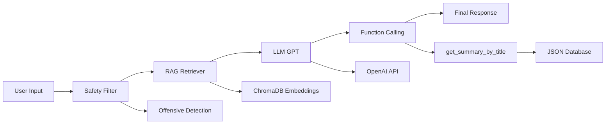

# Smart Librarian AI 📚

Un sistem inteligent de recomandări de cărți folosind AI, dezvoltat cu React TypeScript frontend și FastAPI backend.

## 🌟 Prezentare Generală

Smart Librarian AI este o aplicație modernă care combină inteligența artificială cu o interfață utilizator intuitivă pentru a oferi recomandări personalizate de cărți. Sistemul integrează tehnologii avansate precum procesarea limbajului natural, speech-to-text, text-to-speech și generarea de imagini.

## 🚀 Caracteristici Principale

- **🤖 Chat AI Inteligent**: Conversații naturale pentru recomandări personalizate
- **🎤 Intrare Vocală**: Înregistrare și transcripție audio în timp real
- **🔊 Răspunsuri Audio**: Text-to-Speech pentru o experiență completă
- **🎨 Generare Imagini**: Creare automată de coperte de cărți
- **🔍 Căutare Semantică**: Căutare avansată în baza de date vectorială
- **📊 Monitorizare Sistem**: Dashboard pentru statusul tuturor componentelor
- **📱 Design Responsiv**: Optimizat pentru desktop și mobile

## 🏗️ Arhitectura Sistemului

```
┌─────────────────┐    ┌─────────────────┐    ┌─────────────────┐
│   React Frontend │    │   FastAPI       │    │   AI Services   │
│                 │    │   Backend       │    │                 │
│ • TypeScript    │◄──►│                 │◄──►│ • OpenAI GPT    │
│ • Tailwind CSS  │    │ • REST API      │    │ • Eleven Labs   │
│ • Zustand       │    │ • CORS          │    │ • Whisper STT   │
│ • React Query   │    │ • File Upload   │    │ • DALL-E        │
└─────────────────┘    └─────────────────┘    └─────────────────┘
```

## 🚀 Instalare și Configurare

### Prerequisites
- **Node.js** 18+ pentru frontend
- **Python** 3.8+ pentru backend
- **API Keys** pentru serviciile AI

### 1. Clonare Repository
```bash
git clone <repository-url>
cd smart-librarian
```

### 2. Configurare Backend

```bash
# Instalează dependențele Python
pip install -r requirements.txt

# Configurează variabilele de mediu
cp .env.example .env
# Editează .env cu API keys-urile tale:
# OPENAI_API_KEY=sk-...
# ELEVENLABS_API_KEY=...
```

### 3. Configurare Frontend

```bash
# Navighează în directorul frontend
cd frontend

# Instalează dependențele Node.js
npm install

# Configurează variabilele de mediu
echo "VITE_API_BASE_URL=http://localhost:8000" > .env.local
```

## 🎯 Rulare Aplicație

### Pornire Backend (Terminal 1)
```bash
# În directorul root
python backend/main.py

# Sau cu uvicorn
uvicorn backend.main:app --host 0.0.0.0 --port 8000 --reload

# API disponibil la: http://localhost:8000
# Docs: http://localhost:8000/docs
```

### Pornire Frontend (Terminal 2)
```bash
# În directorul frontend
cd frontend
npm run dev

# UI disponibil la: http://localhost:3000
```

## 🔑 Configurare API Keys

Aplicația necesită următoarele servicii externe:

### OpenAI (Obligatoriu)
```env
OPENAI_API_KEY=sk-proj-...
```
- Folosit pentru: Chat AI și recomandări
- Obține de la: https://platform.openai.com/

### Eleven Labs (Opțional - TTS)
```env
ELEVENLABS_API_KEY=...
```
- Folosit pentru: Text-to-Speech
- Obține de la: https://elevenlabs.io/

### Hugging Face (Opțional - Imagini)
```env
HUGGINGFACE_API_KEY=hf_...
```
- Folosit pentru: Generare imagini alternative
- Obține de la: https://huggingface.co/

Documentația completă și instrucțiunile de instalare se găsesc în:
- [Frontend README](./frontend/README.md) - Ghid complet React TypeScript
- [Backend README](./backend/README.md) - Documentație FastAPI

---

**Smart Librarian AI** - Dezvoltat cu ❤️ pentru iubitorii de cărți din întreaga lume.

*"O carte pe zi ține ignoranța departe"* 📖✨

An advanced AI-powered book recommendation system that combines **OpenAI GPT** for conversation, **ChromaDB** for semantic search, and **function calling** for detailed book summaries. Features both CLI and web interfaces with optional multimedia capabilities.

## Key Features

- **Intelligent Book Recommendations** using RAG (Retrieval-Augmented Generation)
- **Function Calling** for automatic detailed summaries
- **Built-in Safety Filter** for content moderation
- **CLI Interface** with Typer and Rich styling
- **Web Interface** with Streamlit
- **Text-to-Speech** for audio responses (optional)
- **Speech-to-Text** for voice input (optional)
- **AI Image Generation** for book covers (optional)
- **Local Vector Store** with ChromaDB persistence

## Book Dataset

The project includes a curated dataset of **12 classic books** with summaries in Romanian:

| Title | Author | Themes |
|-------|---------|---------|
| 1984 | George Orwell | Freedom, social control, surveillance |
| The Hobbit | J.R.R. Tolkien | Adventure, friendship, courage |
| Dune | Frank Herbert | Power, politics, ecology |
| To Kill a Mockingbird | Harper Lee | Justice, prejudice, moral courage |
| The Catcher in the Rye | J.D. Salinger | Adolescence, alienation, identity |
| The Lord of the Rings | J.R.R. Tolkien | Good vs evil, friendship, sacrifice |
| Pride and Prejudice | Jane Austen | Love, prejudice, society |
| The Name of the Wind | Patrick Rothfuss | Magic, knowledge, revenge |
| The Book Thief | Markus Zusak | War, hope, power of words |
| The Kite Runner | Khaled Hosseini | Friendship, guilt, redemption |
| Brave New World | Aldous Huxley | Social control, technology, freedom |
| Fahrenheit 451 | Ray Bradbury | Censorship, knowledge, rebellion |

## Architecture



### Core Components:

1. **Safety Filter** (`src/safety.py`) - Content moderation and offensive language detection
2. **Vector Store** (`src/vector/`) - ChromaDB for semantic search with OpenAI embeddings
3. **Retriever** (`src/core/retriever.py`) - Semantic book search and ranking
4. **LLM Integration** (`src/ai/llm.py`) - OpenAI GPT with function calling
5. **Tools** (`src/ai/tools.py`) - Function calling for book summaries
6. **Interfaces** - CLI (Typer + Rich) and Web (Streamlit)

## Installation

### Prerequisites

- Python 3.8+ 
- OpenAI API key
- Git

### 1. Clone the Repository

```bash
git clone <repository-url>
cd smart-librarian
```

### 2. Create Virtual Environment

```bash
# Create virtual environment
python -m venv venv

# Activate (Windows)
venv\Scripts\activate

# Activate (Linux/Mac)
source venv/bin/activate
```

### 3. Install Dependencies

```bash
pip install -r requirements.txt
```

### 4. Environment Configuration

Create a `.env` file in the project root:

```env
# Required
OPENAI_API_KEY=your_openai_api_key_here

# Optional (with defaults)
OPENAI_MODEL=gpt-4o-mini
OPENAI_EMBED_MODEL=text-embedding-3-small
CHROMA_PERSIST_DIR=.chroma
```

### 5. Initialize the System

```bash
# Initialize vector database
python -m src.interfaces.chatbot_cli ingest
```

## Usage

### CLI Interface (Primary)

```bash
# Basic chat
python -m src.interfaces.chatbot_cli chat

# With optional features
python -m src.interfaces.chatbot_cli chat --tts --voice --image

# System status
python -m src.interfaces.chatbot_cli status

# Run tests
python -m src.interfaces.chatbot_cli test

# Force rebuild database
python -m src.interfaces.chatbot_cli ingest --force
```

### Web Interface (Streamlit)

```bash
streamlit run src/chatbot_streamlit.py
```

Access at: `http://localhost:8501`

## Example Conversations

### Sample Queries:

**Query:** *"I want a book about friendship and magic."*
```
Smart Librarian: I highly recommend 'The Hobbit' by J.R.R. Tolkien! 
This book perfectly matches your preferences for friendship and magic...

[Automatic function call: get_summary_by_title("The Hobbit")]

Detailed Summary: Bilbo Baggins is a peaceful hobbit from the Shire 
who lives a comfortable and predictable life... [4-6 complete paragraphs]
```

**Query:** *"What do you recommend for war stories?"*
```
Smart Librarian: For war stories, I recommend 'The Book Thief' by Markus Zusak...

[Automatic function call: search_books("war stories")]
[Automatic function call: get_summary_by_title("The Book Thief")]
```

### Conversation Flow:

```
1. User Input → Safety Check → Vector Search → LLM Processing
2. Function Calling → Tool Execution → Context Integration  
3. Final Response → Optional TTS/Image Generation
```

## CLI Commands Reference

| Command | Description | Options |
|---------|-------------|---------|
| `ingest` | Initialize/rebuild vector database | `--force` |
| `chat` | Interactive conversation | `--tts`, `--voice`, `--image`, `--history` |
| `status` | System status and health check | None |
| `test` | Run system diagnostics | None |

### Chat Options:

- `--tts` - Enable text-to-speech (saves MP3 files)
- `--voice` - Enable speech-to-text input
- `--image` - Generate book cover images
- `--history` - Show conversation history

## Configuration

### Environment Variables

```env
# Core Configuration
OPENAI_API_KEY=sk-...                    # Required
OPENAI_MODEL=gpt-4o-mini                 # Default model
OPENAI_EMBED_MODEL=text-embedding-3-small # Embedding model
CHROMA_PERSIST_DIR=.chroma               # Vector DB location

# Optional Features  
MAX_TOKENS=1000                          # Response length
TEMPERATURE=0.7                          # Creativity level
DEFAULT_TOP_K=3                          # Search results count
```

### Project Structure

```
smart-librarian/
├── README.md                 # This file
├── requirements.txt          # Dependencies
├── .env                     # Environment variables
├── data/                    # Book data
│   ├── book_summaries.md    # Short summaries + themes
│   ├── book_summaries.json  # Detailed summaries
│   └── *.backup            # Backup files
├── src/                     # Source code
│   ├── __init__.py
│   ├── chatbot_streamlit.py # Streamlit web app
│   ├── safety.py           # Content filtering
│   ├── tts.py              # Text-to-speech
│   ├── stt.py              # Speech-to-text  
│   ├── image_gen.py        # Image generation
│   ├── ai/                 # AI components
│   │   ├── llm.py          # OpenAI integration
│   │   └── tools.py        # Function calling
│   ├── core/               # Core functionality
│   │   ├── config.py       # Configuration
│   │   ├── schema.py       # Data models
│   │   ├── data_loader.py  # Data loading
│   │   └── retriever.py    # Semantic search
│   ├── interfaces/         # User interfaces
│   │   └── chatbot_cli.py  # CLI interface
│   └── vector/             # Vector operations
│       ├── embeddings.py   # OpenAI embeddings
│       └── vector_store.py # ChromaDB integration
├── tests/                   # Test files
│   └── test_cli.py         # CLI tests
└── output/                  # Generated files
    ├── *.mp3               # Audio files
    ├── *.png               # Generated images
    └── *.wav               # Recorded audio
```

## Testing

### System Tests

```bash
# Full system test
python -m src.interfaces.chatbot_cli test

# Individual component tests
python tests/test_cli.py

# Run with pytest (if available)
pytest tests/ -v
```

### Test Coverage:

- Data loading and consistency
- Vector store functionality  
- Function calling for summaries
- Safety filter validation
- Semantic search accuracy
- CLI interface components

## Optional Features

### Text-to-Speech

**Libraries:** gTTS (online) or pyttsx3 (offline)

```bash
python -m src.interfaces.chatbot_cli chat --tts
```

Generated audio files saved to `output/` directory.

### Speech-to-Text

**Libraries:** OpenAI Whisper API or SpeechRecognition + PyAudio

```bash
python -m src.interfaces.chatbot_cli chat --voice
```

Supports microphone input and audio file transcription.

### AI Image Generation

**Service:** OpenAI DALL-E 3

```bash
python -m src.interfaces.chatbot_cli chat --image
```

Automatically generates book covers for recommendations.

## Why ChromaDB?

ChromaDB was chosen over OpenAI Vector Store for:

1. **Local Control** - Data remains on your system
2. **Persistence** - Database survives between sessions
3. **Performance** - Fast access without API calls for search
4. **Configurability** - Full control over indexing
5. **Cost Efficiency** - No OpenAI credits for storage

## Troubleshooting

### Common Issues:

#### 1. ChromaDB Initialization Failed
```bash
# Windows
rmdir /s .chroma
# Linux/Mac  
rm -rf .chroma

# Rebuild
python -m src.interfaces.chatbot_cli ingest --force
```

#### 2. OpenAI API Errors
```bash
# Check configuration
python -m src.interfaces.chatbot_cli status

# Verify API key in .env file
echo $OPENAI_API_KEY
```

#### 3. Missing Dependencies
```bash
# Reinstall all dependencies
pip install -r requirements.txt --force-reinstall

# For audio features
pip install gTTS pyaudio SpeechRecognition

# For image generation (already in requirements.txt)
pip install Pillow requests
```

#### 4. Import Errors
```bash
# Add src to Python path
export PYTHONPATH="${PYTHONPATH}:./src"

# Or use module syntax
python -m src.interfaces.chatbot_cli
```

### Alternative Vector Stores:

If ChromaDB doesn't work, adapt to use Faiss:

```python
# In src/vector/vector_store.py
import faiss
import numpy as np

class FaissVectorStore:
    def __init__(self, dimension=1536):
        self.index = faiss.IndexFlatL2(dimension)
        self.metadata = []
```

## Performance Metrics

- **Response Time:** ~2-3 seconds average
- **Embedding Generation:** ~500ms per query
- **Vector Search:** <100ms local lookup
- **Function Calling:** ~1-2 seconds per tool
- **Memory Usage:** ~200MB baseline + vector data

## Security Features

- **Content Filtering** - Multi-layer offensive content detection
- **Input Validation** - Pydantic schema validation
- **API Key Protection** - Environment variable isolation
- **Local Storage** - No data sent to third-party vector services

## Future Enhancements

- [ ] **Multi-language Support** - Additional language packs
- [ ] **Goodreads Integration** - Real-time book data
- [ ] **User Profiles** - Personalized recommendations  
- [ ] **PDF Export** - Conversation and summary export
- [ ] **REST API** - HTTP API for integrations
- [ ] **Browser Extension** - Web browser plugin
- [ ] **Library Integration** - Public library catalog search

## Contributing

We welcome contributions! Please follow these steps:

1. **Fork** the project
2. **Create** a feature branch (`git checkout -b feature/AmazingFeature`)
3. **Commit** your changes (`git commit -m 'Add AmazingFeature'`)
4. **Push** to the branch (`git push origin feature/AmazingFeature`)
5. **Open** a Pull Request

### Development Setup:

```bash
# Install dev dependencies
pip install -r requirements.txt
pip install pytest black flake8

# Run code formatting
black src/ tests/

# Run linting
flake8 src/ tests/

# Run tests
pytest tests/ -v
```

## License

This project is licensed under the MIT License - see the LICENSE file for details.

## Support

For issues or questions:

1. **Check Documentation** - Review this README and code comments
2. **Run Diagnostics** - Execute `python -m src.interfaces.chatbot_cli test`
3. **Search Issues** - Check existing GitHub issues
4. **Create New Issue** - Provide detailed error logs and system info

### Support Checklist:

- [ ] Python version (3.8+)
- [ ] Operating system
- [ ] Error messages and stack traces
- [ ] Steps to reproduce
- [ ] Configuration files (without API keys)

---

**Smart Librarian v1.0** - Powered by OpenAI GPT-4 & ChromaDB  
*Intelligent book recommendations with RAG and function calling*